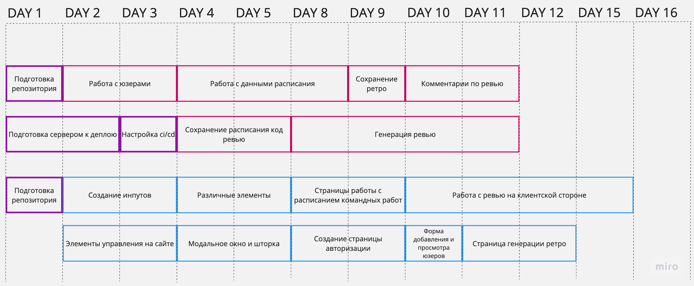

# elbruk bootcamb backoffice
На базе данного проекта я планирую реализовать цикл разработки ПО включающий в себя следующие пункты:
1. Постановка бизнес задачи
1. Постановка технической задачи на основе бизнес задачи
1. Выбор технологий для реализации
1. Декомпозиция технического задания на отдельные задачи и оценка их сложности
1. Составление диаграммы Ганта для понимания сколько программистов было бы разумно нанять для выполнения этого проекта
1. Оценка стоимости проекта
1. Непосредственная реализация проекта (возможно без привлечения других разработчиков)

_Постановка задачи и ее реализация никак не связаны с компанией Эльбрус Буткемп. Но так как я сейчас работаю там и так же испытываю неудобство из-за отсутствия подходящего инструмента, я решил разобрать цикл разработки ПО именно для решения этой проблемы_

## Бизнес задача
Требуется приложение, которое позволило бы решить следующие проблемы:
1. Информация о программе обучения, о мероприятиях со студентами, о проверке экзаменов, о "успеваемости" студентов разобщена и находится в разных местах
1. Из-за цикличности задач для преподавателей классическая канбан доска не информативна. Тем не менее нужно отслеживать выполнение как цикличных задач, так и разовых в одном месте
1. На текущий момент генерация пар и команд сложно редактировать. Изменения в одной паре/команде затрагивают всю группу целиком.

## Техническое задание

### Доступы и данные

- Роли и права:
    1. Админ - имеет права на изменение всего
    1. Преподаватель - работа с задачами, работа со студентами, работа с паро- командо- генератором
    1. Студент - просмотр расписания своей группы
- Информация о пользователе:
    1. ФИО*
    1. email*
    1. github*
    1. телефон
    1. телеграм
    1. роль*
- Информация о группе:
    1. Наименование группы
    1. Дата старта
    1. Текущая фаза (I/II/III)
    1. Кампус (мск, спб, онлайн)
- Информация о пропусках студентом мероприятий:
    1. штрафные баллы
    1. комментарий от преподавателя за что баллы были поставленны
    1. дата, когда баллы были поставлены
    1. ФИО преподавателя, который поставил баллы
- информация о результатах проведения ревью (не видна студенту):
    1. общий комментарий преподавателя о студенте
    1. ФИО преподавателя, проводившего ревью
    1. дата ревью
    1. оценка по 7 бальной шкале, примерно оценивающая текущий уровень знаний и навыков студента
- информация о парах/командах студентов:
    1. дата для пар/команд
    1. список студентов в паре/команде
- информация о ревью:
    1. дата и время проведения ревью
    1. преподаватель проводящий ревью
    1. студент, с кем проходит ревью
- информация о результате экзамена:
    1. ФИО студента
    1. ссылка на пулреквест (для I и II фаз)
    1. фаза
    1. проверяющий преподаватель
    1. комментарий от проверяющего преподавателя
    1. предварительный результат
    1. окончательный результат
- информация о лекциях:
    1. группа, для которой читается лекция
    1. тема лекции
    1. фаза лекции
    1. преподаватель
    1. дата
    1. оценка лекции самим преподавателем
    1. комментарий от преподавателя
    1. дополнительная оценка лекции от руководителя/других преподавателей
    1. дополнительный комментарий
- информация о задачах:
    1. заголовок
    1. описание
    1. исполнитель
    1. автор
    1. срок
    1. тэги
    1. комментарии к задаче
    1. текущий статус

### Требования к паро- командо- генератору

- Пары должны максимально не повторятся на протяжении всех трех фах обучения
- Команды так же должны максимально не повторятся на протяжении всех фаз
- В начале фазы генерируются пары и команды на всю фазу
- Если в течение фазы кто-то из студентов ушел, то пары должны перегенерироваться
- У преподавателей есть возможность вручную изменить пары или команды при необходимости
- После ручного изменения пар, будущие пары должны перегенерироваться, чтобы пары максимально не повторялись
- Студенты могут просматривать свои пары и команды на текущую неделю
- В течение командного проекта команды не изменяются. Проект может длиться несколько дней
- Преподаватели могут устанавливать расписание дней соло, парного и командного программирования

### Требования к генератору ревью

- При подготовке к генерации код ревью должны быть возможности:
  - Выбрать в какие дни какое время будет доступно для код ревью
  - Какие преподаватели доступны на код ревью
- После генерации код ревью у преподавателей должна быть возможность изменить расписание вручную
- При генерации код ревью необходимо по максимуму учитывать пары и команды студентов, а так же пары преподавателей:
  - Если два студента работают в паре, то предпочтительнее их поставить в одно время на код ревью
  - Если два преподавателя работают в паре с одной группой, то желательно не ставить их на ревью в одно и то же время
  - Желательно чтобы у преподавателя был минимум окон
  - Генерация должна учитывать занятость преподавателя на ревью с другими группами
  - Генерация должна равномерно распределять количество ревью между преподавателями и днями, отведенными для ревью
- Длительность одного ревью 25 минут
- После составления расписания ревью или изменения необходимо создать события в календаре и отправить уведомления на почту участникам
- Слоты для ревью начинаются с 14-30 по мск
- Точки начала ревью кратны 30 минутам: 14-30, 15-00, 15-30 и тд
- После проведения ревью преподаватель должен иметь возможность оставить отзыв о студенте в системе
- Должна быть возможность отметить, что студент не пришел, чтобы
  - это зафиксировалось в системе
  - это не повлияло на среднюю оценку

### Требования к просмотру отзывов о студентах

- Просмотр отзывов должен быть доступен только преподавателям и админам
- Автор отзыва должен иметь возможность изменить свой отзыв в течение 24 часов
- Кроме комментариев с ревью здесь должна отображаться информация о прохождении студентом экзаменов

### Генерация пятничного ретро

- Три фазы в равных пропорциях должны разделиться между доступными скрам мастерами
- В роли скрам мастеров выступают преподаватели или другие сотрудники компании
- По умолчанию в качестве скрам мастеров должны быть доступны преподаватели кампуса
- Необходимо иметь возможность исключить одного или нескольких преподавателей из списка скрам мастеров на текущее пятничное ретро
- Необходимо иметь возможность добавить дополнительных скрам мастеров на текущее пятничное ретро
- Необходимо иметь возможность исключить одного или нескольких студентов из генерации ретро
- Необходимо иметь возможность ручной корректировки получившегося ретро

### Проверка экзамена

- На основании ссылки на шаблон гитхаба должны генерироваться ссылки на пулреквесты студентов
- В начале проверки должна быть возможность отключить кого-либо из преподавателей от проверки экзамена
- После начала проверки каждому преподавателю должен выдаваться случайный студент
- Должен быть шаблон оценки каждого экзамена, чтобы преподаватель мог просто по ходу дозаполнять данные
- Как только преподаватель закончил проверять текущего студента - результаты сабмитятся и ему достается новый случайный студент из тех, что еще не проверили и не проверяют прямо сейчас
- После того как все преподаватели завершили проверку экзамена становится доступна таблица с результатами проверки
- Преподаватели могут поставить предварительный результат экзамена и конечный
- Как только стали известны все конечные результаты должно генерироваться сообщение с информацией об итогах

### Распределение лекций

- С начала фазы преподавателям доступна информация о запланированных лекциях на текущую фазу
- Преподаватели могут назначать себя на эти лекции
- Админ может назначать других преподавателей на лекции

### Добавление задач

- Задача может быть добавлена на конкретный день и время
- Задача может быть добавлена со сроком дедлайна
- При создании или редактировании задачи можно изменять все доступные поля

### Просмотр задач

- Должна быть возможность просмотреть все задачи, лекции, ревью преподавателя с таймлайном их сроков по типу календаря
- Должна быть возможность просмотреть задачи всех преподавателей на конкретный день с таймлайном их выполнения по типу календаря

### Добавление сотрудников/студентов

- Должна быть возможность добавить сотрудника/студента в виде csv файла со всеми его данными
- Должна быть возможность редактировать и удалять сотрудника/студента
- Авторизация сотрудников студентов должна происходить через гитхаб
- Роль сотрудника должна быть задана до его первой авторизации

### Работа с программой

- Студенты должны иметь возможность просматривать программу текущей фазы и предыдущих фаз
- Преподаватели должны иметь возможность просматривать программу всех фаз
- Админ должен иметь возможность редактировать программу:
  - Добавлять/изменять лекции
  - Изменять дни соло, парного и командного программирования

## Нефункциональные требования к системе

- Производительность:
  - Время ожидания на получение данных не превышает 1с
  - Время ожидания на изменение данных не превышает 2с
  - Количество пользователей до 1 000
- Доступность:
  - Система должна быть доступна не менее 98% от рабочего времени
- Безопасность:
  - Пользователи должны иметь доступ только к тем данным, которые определены их ролью
  - Незарегестрированный пользователь не должен иметь доступа к каким либо данным

## Выбор стека технологий

1. Бэкенд 
   - Nestjs + typescript - выбор обусловлен наличием пула разработчиков, которых можно привлечь к работе
   - Авторизацию необходимо выполнить с использованием гитхаба. Каждый наш пользователь должен иметь свой гитхаб аккаунт
   - TypeORM - рекомендована на nestjs для работы с базами данных, при этом функционала этой орм будет достаточно для реализации задачи
2. Фронтенд
   - React + typescript -выбор обусловлен наличием пула разработчиков, которых можно привлечь к работе
   - Nextjs - для более быстрого старта работы приложения за счет серверного рендеринга
   - Tailwindcss - для меньшего объема итоговых стилей. В системе будет отсутствовать сложные компоненты, для которых пришлось бы подключать стороннюю библиотеку компонентов. За счет малого числа необходимых компонент есть возможность быстро реализовать ui-kit и уменьшить итоговый размер файлов, отправляемых клиенту
3. Хранение данных
   - Postgres - выбор обусловлен высокой связностью и структурностью данных
   - Redis - под вопросом, но при необходимости ускорить частые запросы или для хранения сессий пользователей возможно его использование
   - MongoDB - возможно использование этой БД для работы с программой занятий.

## Декомпозиция, приоритизация и оценка сложности задач

Больший приоритет имеет функционал, который уже реализован на текущем сервисе, для перехода на новый функционал. К ним относятся: 
- Разграничение пользователей по ролям
- Добавление новых пользователей
- Паро- и командо-генератор
- Генератор ретро
- Возможность оставлять комментарии о результатах ревью
- Возможность для преподавателей и админов просматривать комментарии о ревью
- Возможность выбирать в какой день как студенты должны работать: соло, пары или команды

Следующий приоритет имеет следующий функционал:
- Добавление и просмотр задач для преподавателей на конкретный день
- Просмотр расписания на день для студента/преподавателя/преподавателей
- Возможность просмотра и редактирования программы курса
- Создание и проверка экзамена согласно тз

Последний приоритет имеет следующий функционал:
- Создание задач классических задач для канбан доски

### Эпики и оценка сложности

Для хранения задач и эпиков используются [issues](https://github.com/GizmoDevDev/elbruk-bootcamb-backoffice/issues) и [milestones](https://github.com/GizmoDevDev/elbruk-bootcamb-backoffice/milestones) гитхаба.  
Для контроля текущего статуса задач - [Github projects](https://github.com/users/GizmoDevDev/projects/1/views/1)

В рамках данного проекта я буду использовать _передовую_ оценку сложности задачи в попугаях. Один попугай примерно полдня работы.

Для декомпозиции проекта на конкретные задачи используется вертикальная и затем горизонтальная декомпозиция:
1. исходя из функционала формируется milestone
2. milestone разбивается на задачи в соответствии с этапом работы: базы данных, бэкенд, фронтенд. При необходимости для каждого направления может быть сформированно больше одной задачи 

#### Версия 0.1
- [Инициализация репозитория](https://github.com/GizmoDevDev/elbruk-bootcamb-backoffice/issues/2) - **2 попугая**
- [Подготовка к деплою](https://github.com/GizmoDevDev/elbruk-bootcamb-backoffice/issues/17) - **2 попугая**
- [Создание пользователей и ролей](https://github.com/GizmoDevDev/elbruk-bootcamb-backoffice/milestone/1) - **5 попугаев**
- [Хранение и редактирование формата работы студентов для паро- и командо-генератора](https://github.com/GizmoDevDev/elbruk-bootcamb-backoffice/milestone/2) - **5 попугаев**
- [Хранение и генерация пятничного ретро](https://github.com/GizmoDevDev/elbruk-bootcamb-backoffice/milestone/3) - **4 попугая**
- [Работа с ревью и комментариями](https://github.com/GizmoDevDev/elbruk-bootcamb-backoffice/milestone/4) - **12 попугаев**
- [ui-kit](https://github.com/GizmoDevDev/elbruk-bootcamb-backoffice/milestone/5) - **8 попугаев**

Промежуточный итог: 38 попугаев (152 человеко-часа). Из них:
- 4 попугая (16чч) - общие задачи
- 19 попугаев (76чч) - фронтенд
- 15 попугаев (60чч) - бэкенд + БД

Написание тестов на 100% или создание сторибука на данном этапе не планируется для ускорения ввода в эксплуатацию.
По завершении работы над версией 0.1 планируется выделение дополнительного времени перед началом работы над версией 0.2 на написание тестов и корректировку текущего плана.
Для написания тестов бэкендом планируется выделить время, в течение которого фронтенд будет дорабатывать свои задачи.

Исходная оценка одного попугая в полдня работы использовалась для оценки временной сложности, если не возникнет непредвиденных сложностей.
Предлагаю взять запас по времени и увеличить оценку одного попугая до полного рабочего дня.
Так как в течение дня программистам надо делать ревью кода друг друга, участвовать в митингах, возможно доуточнять постановку задач.
Так же это даст дополнительное время на написание тестов
Таким образом временные затраты увеличатся в два раза:
- 4 попугая (32чч) - общие задачи
- 19 попугаев (152чч) - фронтенд
- 15 попугаев (120чч) - бэкенд + БД

Итоговая оценка должна адаптироваться под команду. С текущей временной оценкой на проект можно ставить сильных джунов и при этом уложиться в сроки.
Для мидл и сеньор разработчиков временная оценка должна меняться в меньшую сторону [исходник диаграммы](https://miro.com/app/board/uXjVMSDhrng=/?share_link_id=233067921406)

Исходя из текущей диаграммы можно ожидать, что если выделить 4 программистов на этот проект, из которых 2 мидла и 2 джуна, то можно ожидать сокращение временных затрат на задачи.
Как итог первую версию можно реализовать в течение одного двухнедельного спринта.

Денежные затраты на первую версию приложения при этом составят: 300 000 рублей. Оценка стоимости при следующих условиях:
- мидл разработчик получает 200 000 рублей в месяц
- джуниор разработчик получает 100 000 рублей в месяц
- 2 мидл и 2 джуниор разработчика будут задействованы в течение полумесяца

Есть возможность сократить расходы до ~250 000 рублей, для этого придется отказаться от мидл разработчиков. В таком случае качество кода может сильно ухудшиться. 
Плюс у джуниор разработчиков может не хватить экспертизы для реализации расширяемого и поддерживаемого приложения.
Как итог может вырасти цена на реализацию следующих версий, которых запланировано еще две
